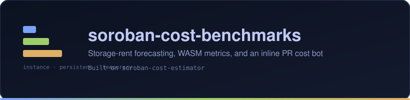

<p align="center">
  
</p>

<p align="center">
  <a href="https://github.com/aigbagbobila/soroban-cost-benchmarks/actions/workflows/ci.yml">
    
  </a>
  
  
  <a href="https://github.com/Stellar-Cost-Labs/soroban-cost-estimator/issues/267">
    
  </a>
</p>

# soroban-cost-benchmarks

**Storage-rent forecasting, WASM metrics, and an inline PR cost comment bot** — built on
[`soroban-cost-estimator`](https://github.com/Stellar-Cost-Labs/soroban-cost-estimator).

> ⚠️ This is unaudited developer tooling. Always verify fee estimates against your
> target network before mainnet deployment.

---

## Where this repository lives

This project currently lives under a **personal account**:
[`aigbagbobila/soroban-cost-benchmarks`](https://github.com/aigbagbobila/soroban-cost-benchmarks).
A transfer to the [`Stellar-Cost-Labs`](https://github.com/Stellar-Cost-Labs) org is
planned, but **has not happened** — `Stellar-Cost-Labs/soroban-cost-benchmarks` does
not exist yet (GitHub returns 404), and the maintainer deferred the transfer until the
documentation is finished.

Some metadata already points at the *planned* org URL — `Cargo.toml`'s `repository`
field and the footer of every generated PR comment both say `Stellar-Cost-Labs`. Treat
those as intentions, not as the current canonical location. The working `git remote`
is correct: it points at the personal account.

There is **no organizational relationship** with any tool named in the comparison
below, and none is implied.

---

## What makes this different

The Stellar/Soroban ecosystem already has cost tooling. Two capabilities were checked
specifically, and neither was claimed when this project started.

A competitive re-check was run on **2026-09-10**, before implementation began, against:

| Tool checked | Multi-horizon rent forecasting | Inline PR cost comments |
|---|---|---|
| [Soroban Rent Calculator](https://leighmcculloch.github.io/soroban-rent-calculator/) | ❌ single-entry web calculator | ❌ |
| [Forge-soroban](https://github.com/Forge-soroban/Forge-soroban) | ❌ gas metering only | ❌ |
| [`soroban-cost-estimator`](https://github.com/Stellar-Cost-Labs/soroban-cost-estimator) | ❌ real-time rent only, via simulation | ❌ |
| Trellis — feature request in issue #150 | not implemented | ❌ |
| Fluxora — feature request in issue #687 | not implemented | ❌ |

The same re-check found nothing had shipped that undercut either lead feature. So the
claim below is stated as fact, not as aspiration.

### 1. Storage-rent forecasting (lead feature)

This tool projects **30-day, 180-day, and 365-day rent costs** per storage tier
(Instance / Persistent / Temporary) from **live network config rates** — the real
`ConfigSettingContractLedgerCostV0` and `ConfigSettingStateArchival` values, fetched
from RPC. No hardcoded rates. Numbers in this README come from live testnet
([`tests/fixtures/`](tests/fixtures/README.md)).

### 2. Inline PR cost comment (second lead feature)

No tool in that list posts a **structured cost + rent forecast summary into a GitHub PR
conversation**. The closest alternatives require clicking through to a separate
dashboard. This tool creates a comment on the first run and **edits the same comment in
place** on later pushes, identified by a hidden marker. Update-in-place is proven, not
inferred (see [Verified against live testnet](#verified-against-live-testnet)).

### What is *not* differentiating

Historical cost tracking, regression detection, and CI-blocking thresholds already
exist elsewhere in the Soroban ecosystem. Those are supporting infrastructure here for
the PR comment bot, not headline features. The `compare` command is deliberately
minimal.

---

## Quick start

Not published on crates.io yet, so install from source:

```bash
git clone https://github.com/aigbagbobila/soroban-cost-benchmarks
cd soroban-cost-benchmarks
cargo install --path .
```

### Forecast storage rent (no setup — fetches live config by default)

```bash
soroban-cost-benchmarks rent-forecast \
  --entry persistent:1024 \
  --entry persistent:2048 \
  --entry temporary:512
```

### Show exactly where the rent rates came from

```bash
soroban-cost-benchmarks live-config
soroban-cost-benchmarks live-config --out snapshot.json   # also write the snapshot
```

### Reuse a saved snapshot instead of hitting the network

```bash
soroban-cost-benchmarks rent-forecast \
  --config-snapshot snapshot.json \
  --entry persistent:1024
```

### Placeholder rates are opt-in only, and labelled

```bash
soroban-cost-benchmarks rent-forecast --allow-demo --entry persistent:1024
# ⚠️  --allow-demo: using placeholder rent rates. These are NOT network data ...
# JSON gets:  "config_source": "demo-config (NOT network data)", "config_ledger": 0
```

---

## Command reference

Global flags accepted by every subcommand: `--network <testnet|mainnet|futurenet>`
(default `testnet`), `--rpc-url <url>`, `--allow-demo`, `-v/--verbose`.

### `rent-forecast`

Project rent per tier at one or more day horizons.

```bash
soroban-cost-benchmarks rent-forecast [-e <tier:bytes>]... [--horizons 30,180,365] [--json|--csv] [-o <path>]
```

| Flag | Meaning |
|---|---|
| `-e, --entry <tier:bytes>` | Storage entry, repeatable. Tiers: `instance`, `persistent`, `temp`/`temporary`. Defaults to `persistent:1024` if omitted. |
| `--config-snapshot <path>` | Use a saved snapshot instead of fetching live. |
| `--horizons <a,b,c>` | Comma-separated day horizons. Default `30,180,365`. |
| `--json` / `--csv` | Machine-readable output. |
| `-o, --output <path>` | Write to a file instead of stdout. |

### `live-config`

Fetch all `ConfigSetting*` entries live and report per-setting provenance, the current
ledger, the stale ledger the upstream command would have reported, the state-size
window, and the resulting effective rate. `-o, --out <path>` also writes the snapshot
as JSON.

### `wasm-metrics`

Static analysis of a compiled `.wasm` file: total/code/data/custom section sizes,
function/global/table/memory counts, import/export counts, and Soroban contract-spec
detection.

```bash
soroban-cost-benchmarks wasm-metrics -w path/to/contract.wasm [--json] [-o <path>]
```

### `benchmark`

Compute rent across the four standard scenarios — `empty`, `minimal`, `populated`,
`heavy` — or a custom footprint passed with `-e`. Accepts `--config-snapshot`, `--json`,
`-o`.

> The `cpu_instructions`, `memory_bytes`, read/write and tx-size fields in a benchmark
> report are currently placeholders at `0`. This command computes rent projections only;
> it does not measure resource consumption. See [Limitations](#limitations).

### `compare`

Diff two cost snapshots and flag rent increases over a threshold. Exits **1** when a
regression is detected, so it works as a CI gate.

```bash
soroban-cost-benchmarks compare --baseline baseline.json --current current.json --threshold 10.0 [--json]
```

Markdown is the default output format. `--markdown` is accepted for symmetry but is
currently a no-op — JSON is selected with `--json` and everything else renders Markdown.

### `export`

Re-serialize a rent forecast produced by `rent-forecast --json`.

```bash
soroban-cost-benchmarks export --forecast forecast.json --format csv [-o <path>]
```

`--format` accepts `json` (default) or `csv`; any other value falls through to JSON.

### `pr-comment`

Post or update the cost summary comment on a GitHub PR.

```bash
export GITHUB_TOKEN=ghp_...

soroban-cost-benchmarks pr-comment \
  --owner myorg --repo myrepo --pr-number 42 \
  --forecast forecast.json \
  [--wasm-metrics wasm.json] \
  [--comparison comparison.json] \
  [--dry-run]
```

| Flag | Meaning |
|---|---|
| `--owner`, `--repo`, `--pr-number` | Target PR. |
| `--forecast <path>` | **Required.** A rent-forecast JSON file. |
| `--wasm-metrics <path>` | Optional WASM metrics JSON, rendered as its own section. |
| `--comparison <path>` | Optional comparison JSON, rendered as its own section. |
| `--dry-run` | Print the rendered comment and make **no** GitHub API call. Needs no token. |

**`pr-comment` does not fetch live config on its own.** It requires an explicit
`--forecast <path>` and errors out without one. This is a real deviation from the
"live by default" policy the rest of the tool follows: everywhere else, omitting
`--config-snapshot` triggers a live RPC fetch, but the bot has no config path of its
own. Feed it a forecast produced by `rent-forecast`, whose live fetch is real:

```bash
soroban-cost-benchmarks rent-forecast --entry persistent:1024 --json > forecast.json
soroban-cost-benchmarks pr-comment --owner myorg --repo myrepo --pr-number 42 --forecast forecast.json
```

The bot locates its own comment by a hidden marker
(`<!-- soroban-cost-benchmarks bot -->`). If found it updates that comment; otherwise it
creates one. It never posts a duplicate.

---

## Storage-rent formula

Rent is a two-step computation, mirroring
[`rs-soroban-env` `fees.rs`](https://github.com/stellar/rs-soroban-env/blob/main/soroban-env-host/src/fees.rs)
(`compute_rent_write_fee_per_1kb` → `rent_fee_for_size_and_ledgers`). See
[CAP-0046-12](https://github.com/stellar/stellar-protocol/blob/master/core/cap-0046-12.md)
for the protocol background. All arithmetic is integer `ceil` division — no floating
point.

**Step 1 — effective rate per 1 KB**, interpolated across the Soroban state size curve
and floored:

```
multiplier = max(high - low, 0)
if state_size < state_target_size_bytes:
    rate = ceil(multiplier × state_size / state_target_size_bytes) + low
else:
    rate = high + ceil(multiplier × (state_size - target) × growth_factor / target)
rate = max(rate, 1000)          # MINIMUM_RENT_WRITE_FEE_PER_1KB
```

**Step 2 — fee for a size and a number of ledgers**:

```
rent_fee = ceil(size_bytes × rate × ledgers) / (1024 × rate_denominator)
```

Where:

- `low`/`high` = `rent_fee1_kb_soroban_state_size_{low,high}` from
  `ConfigSettingContractLedgerCostV0`
- `growth_factor` = `soroban_state_rent_fee_growth_factor` — a **raw multiplier** applied
  only to state beyond the target, *not* a percentage, and inert while the network is
  below target
- `state_size` = mean of the on-chain `LiveSorobanStateSizeWindow` samples
- `rate_denominator` = `persistent_rent_rate_denominator` (Persistent and Instance) or
  `temp_rent_rate_denominator` (Temporary) from `ConfigSettingStateArchival`

On testnet (2026-09-12) `low = -17000`, so an earlier revision of this tool that used
`low` directly as the rate produced **zero** rent. The floor is what makes real output
non-zero. See [`tests/fixtures/README.md`](tests/fixtures/README.md) §4.

---

## How it works

```
                       ┌───────────────────────────────────────────────┐
   ConfigSetting* ─────▶│ live-config                                   │
   (RPC getLedgerEntries│   • getLatestLedger  → current ledger         │
    + getLatestLedger)  │   • workaround for upstream bug #267          │
                       │   • LiveSorobanStateSizeWindow → state size   │
                       └───────────────────────┬───────────────────────┘
                                               │ snapshot + provenance
                                               ▼
   .wasm file ──▶ ┌────────────────┐   ┌──────────────────┐   ┌─────────────────┐
                  │ wasm-metrics   │   │ rent-forecast    │   │ benchmark       │
                  │ (static sizes, │   │ (30/180/365-day  │   │ (4 standard     │
                  │  fn counts)    │   │  rent per tier)  │   │  scenarios)     │
                  └───────┬────────┘   └────────┬─────────┘   └────────┬────────┘
                          │ wasm.json             │ forecast.json        │ report.json
                          │                       │                      │
   snapshot pair ──▶ ┌────▼────────┐              │                      │
                     │ compare     │──comparison──┤                      │
                     │ (threshold, │    .json     │                      │
                     │  exit 1)    │              │                      │
                     └─────────────┘              │                      │
                                                  ▼                      │
                                       ┌──────────────────────┐          │
                                       │ pr-comment  ──▶ GitHub PR     │
                                       │ (create/update one   │          │
                                       │  comment in place)   │          │
                                       └──────────────────────┘          │
                                                                         │
   forecast.json ──▶ ┌──────────────┐                                    │
                     │ export       │──▶ JSON / CSV                      │
                     └──────────────┘                                    │
```

Two things worth calling out in that picture:

1. **`live-config` is its own step**, not a hidden helper. It is the workaround for the
   upstream bug, and it is where the ledger provenance is produced.
2. **`pr-comment` consumes files, not network state.** Everything that talks to the
   network does so upstream of it, in `rent-forecast` / `benchmark` / `live-config`.

### Module layout

```
soroban-cost-benchmarks
├── src/
│   ├── lib.rs              # Library root
│   ├── rent_forecast.rs    # Lead feature: 30/180/365-day rent projections
│   ├── live_config.rs      # Live ConfigSetting* fetch (upstream-bug workaround)
│   ├── wasm_metrics.rs     # WASM static analysis
│   ├── benchmark.rs        # Multi-scenario rent benchmarking
│   ├── compare.rs          # Snapshot diff & regression threshold
│   ├── pr_comment.rs       # GitHub PR comment bot (update-in-place)
│   ├── error.rs            # Error types
│   └── main.rs             # CLI binary
├── assets/logo.svg         # Banner
├── docs/                   # Documentation (and the upstream issue report)
├── tests/fixtures/         # Captured real evidence (see its README)
└── .github/workflows/ci.yml
```

### Dependency: `soroban-cost-estimator`

This project depends on
[`soroban-cost-estimator`](https://crates.io/crates/soroban-cost-estimator) as a
**library** (crates.io v0.1.0, published 2026-08-03) — not as a CLI wrapper. It imports:

- `config_snapshot::model::ConfigSnapshot`
- `config_snapshot::model::StateArchivalV0`
- `config_snapshot::model::ContractLedgerCostV0`
- `rpc::client::RpcClient`, `rpc::config::fetch_all_config_settings`, `xdr_helper`

It does **not** re-implement RPC simulation or WASM parsing from the estimator. The
estimator's own repository now lives under the org at
`Stellar-Cost-Labs/soroban-cost-estimator`.

### Known upstream bug, and the workaround here

`soroban-cost-estimator` v0.1.0's `config snapshot` command stamps
`ConfigSnapshot.ledger` with the **max `last_modified_ledger` of the fetched
`ConfigSetting*` entries**, not the network's current ledger. Config settings only
change on governance events, so that value is frozen between upgrades and every run
reports the same long-stale ledger:

```
Current ledger:     4635348   (getLatestLedger)
Upstream would say: 3470630   (max last_modified_ledger — stale by 1,164,718 ledgers)
```

**This is tracked upstream as
[issue #267](https://github.com/Stellar-Cost-Labs/soroban-cost-estimator/issues/267)**
(opened 2026-09-13, still open).

Until it is fixed, [`src/live_config.rs`](src/live_config.rs) fetches the same entries
via `getLedgerEntries` and stamps the snapshot with the current ledger from
`getLatestLedger`. **This is a deliberate, disclosed workaround for a tracked upstream
bug — not a silent reimplementation.** It reuses the estimator's own `RpcClient`,
`fetch_all_config_settings`, and `xdr_helper`, and differs only in which ledger is
stamped. The module is **marked for deletion** once #267 closes, and
`live_config::UPSTREAM_ISSUE_URL` already points at the real issue.

The prepared report — including acceptance criteria and implementation hints — is kept
in [`docs/upstream-issue-config-snapshot-stale-ledger.md`](docs/upstream-issue-config-snapshot-stale-ledger.md).

---

## Verified against live testnet

Everything in this section is captured output, not illustration. The full record and
reproduction steps live in [`tests/fixtures/README.md`](tests/fixtures/README.md).

### Rent forecast — real, current, and provably not demo fallback

Captured 2026-09-12 against Stellar testnet:

```
config_ledger:  4635349
config_source:  rpc:getLedgerEntries@4635349 (testnet)
rate_basis:     interpolated (state 2659201588 < target 4000000000)
```

The same entries and horizons were then run in `--allow-demo` mode and compared, to
prove the tool is not quietly serving placeholders:

| Tier | Days | Size (B) | Live (stroops) | Demo (stroops) | Live/demo |
|---|---|---:|---:|---:|---:|
| Persistent | 30 | 1024 | 426,667 | 160,355 | 2.66 |
| Persistent | 180 | 1024 | 2,560,000 | 962,129 | 2.66 |
| Persistent | 365 | 1024 | 5,191,112 | 1,950,983 | 2.66 |
| Persistent | 30 | 2048 | 853,334 | 320,710 | 2.66 |
| Persistent | 180 | 2048 | 5,120,000 | 1,924,257 | 2.66 |
| Persistent | 365 | 2048 | 10,382,223 | 3,901,965 | 2.66 |
| Temporary | 30 | 512 | 106,667 | 80,178 | 1.33 |
| Temporary | 180 | 512 | 640,000 | 481,065 | 1.33 |
| Temporary | 365 | 512 | 1,297,778 | 975,492 | 1.33 |

Live and demo differ by **1.33× to 2.66×**. The demo rates understate real testnet rent
by more than half for persistent storage.

The workaround was independently cross-checked three ways at
`2026-09-12T08:04:46Z` — Horizon `GET /ledgers?order=desc&limit=1`, raw RPC
`getLatestLedger`, and `live-config` itself all returned **4635340**, with no lag
discrepancy.

### PR comment bot — real round-trip, update-in-place

Against a throwaway PR (`#1`, since closed) on `aigbagbobila/soroban-cost-benchmarks`,
driven by a fresh live forecast:

```
RUN 1   Comment posted/updated: ID 5652127269   created_at 08:08:27Z  updated_at 08:08:27Z
RUN 2   Comment posted/updated: ID 5652127269   created_at 08:08:27Z  updated_at 08:08:37Z
        comment count on PR #1: 1
```

Same comment ID both runs, `created_at` unchanged, `updated_at` advanced, count stayed
at **1** — the second run edited the existing comment rather than posting a duplicate.

The first live call exposed a real shipped defect that no unit test could catch: with
both `octocrab`'s default `rustls-ring` and the estimator's `aws-lc-rs` provider compiled
in, rustls 0.23 refused to pick a process-level `CryptoProvider` and `octocrab` panicked
before opening a socket. Fixed in `Cargo.toml` by selecting `rustls-aws-lc-rs` for
`octocrab` and restating its other defaults, leaving exactly one provider in the graph.

The exact posted body is preserved verbatim in
[`tests/fixtures/pr-comment-posted-body.md`](tests/fixtures/pr-comment-posted-body.md).

---

## Limitations

Read this before quoting any number.

- **Only the rent-forecast path has end-to-end live proof.** The `wasm_metrics` and
  `comparison` sections of the PR comment have **only ever rendered from synthetic
  unit-test data** — no real `.wasm` file and no real comparison has been fed through a
  live post. `wasm-metrics` has likewise never been run against a real compiled
  contract in any recorded session.
- **The Soroban state size used for rent is an approximation.** It is the *mean* of the
  30 `LiveSorobanStateSizeWindow` samples. The tool labels the basis it used
  (`rate_basis`) rather than presenting it as exact. On the captured day it did not
  change the result — any state size below ~2.52 GB lands on the same protocol floor —
  but it is an approximation.
- **This is a first-order rent projection, not a protocol-accurate simulation.**
  Code-entry rent discounts and per-entry TTL-vs-size top-up fees are **not modelled**.
  Nothing here replaces `simulateTransaction`.
- **`Cargo.lock` is gitignored** even though this is a binary crate, so builds are not
  pinned to the dependency versions the captured evidence was produced with. Tracked as
  open decision [#8](https://github.com/aigbagbobila/soroban-cost-benchmarks/issues/8),
  not yet resolved.
- **`benchmark` reports rent only.** Its resource fields (`cpu_instructions`,
  `memory_bytes`, read/write entries and bytes, tx size) are hardcoded to `0`. Do not
  read a benchmark report as a resource measurement.
- **`compare --markdown` is accepted but ignored.** Markdown is already the default for
  non-JSON output, so the flag currently does nothing.
- **The bot has only ever run against a PR with no ruleset in force.** Whether a
  required-status-check ruleset interacts with the comment job is untested. The
  repository's `Main_ruleset` was created *after* that run.
- **The filed upstream issue carries a stale header.** Issue #267's body was pasted with
  this repo's own report front matter attached, including a "NOT YET FILED" line.
  Correcting it needs `Issues: write` on the sibling repo, which this environment does
  not have. The corrected text is in
  [`docs/`](docs/upstream-issue-config-snapshot-stale-ledger.md).

---

## Project status

✅ means proven with captured real output. 🔲 means not yet proven.

| Capability | Status |
|---|---|
| `rent-forecast` against live testnet config | ✅ |
| `live-config` provenance + workaround | ✅ |
| `pr-comment` live round-trip (rent-forecast section) | ✅ |
| Update-in-place (no duplicate comments) | ✅ |
| `wasm-metrics` | 🔲 unit tests with synthetic WASM only |
| PR comment `wasm_metrics` / `comparison` sections | 🔲 synthetic data only |
| `compare` regression gate | 🔲 unit tests only, no live run |
| `benchmark` | 🔲 rent projections only; resource fields are zeros |
| `export` | 🔲 no dedicated live run |
| Storage-rent formula correctness | ✅ unit-tested against the protocol's two-step calculation |
| Live config fetch by default (no silent demo fallback) | ✅ |

---

## Testing & CI

**39 unit tests** (`#[test]` functions across `src/`): 17 in `rent_forecast`, 6 in
`benchmark`, 6 in `live_config`, 4 in `compare`, 4 in `wasm_metrics`, 2 in
`pr_comment`. They cover the fee math (including the negative-`low` regression),
RPC/provenance handling, XDR-adjacent config extraction, the threshold comparison, and
Markdown rendering.

The gate commands, exactly as CI runs them:

```bash
cargo fmt --check
cargo clippy --all-targets --all-features
cargo test --workspace
cargo build --release
```

> The count above is taken from the source. `cargo` was not available in the
> environment where this README was last edited, so a local `cargo test` was not run
> there — **CI is the authority**.

`main` is protected by the `Main_ruleset` (ruleset ID `23152648`), which requires the
four CI checks to be green and forbids branch deletion and force-pushes:

| Check name | CI job |
|---|---|
| `Formatting` | `cargo fmt --check` |
| `Clippy` | `cargo clippy --all-targets --all-features` (all + pedantic at deny) |
| `Tests` | `cargo test --workspace` |
| `Build` | `cargo build --release` |

The latest run on `main` (run `34748180579`, 2026-09-13) passed all four jobs. The
maintainer account is a `bypass_actors` entry on the ruleset with
`current_user_can_bypass: always`, so direct pushes to `main` are possible while still
being blocked for everyone else.

---

## Installation

### Prerequisites

- **Rust 1.85+** (edition 2024; `rust-version = "1.85"` in `Cargo.toml`)
- **Network access** to a Soroban RPC endpoint — required by `rent-forecast`,
  `live-config` and `benchmark` unless you pass `--config-snapshot`
- A **GitHub token** with `Issues: write` on the target repository, for `pr-comment`
  (not needed with `--dry-run`)

Default RPC endpoints, resolved by the estimator:

| Network | Endpoint |
|---|---|
| `testnet` | `https://soroban-testnet.stellar.org` |
| `mainnet` | `https://soroban.stellar.org` |
| `futurenet` | `https://rpc-futurenet.stellar.org` |

Override with `--rpc-url`.

### From source

```bash
git clone https://github.com/aigbagbobila/soroban-cost-benchmarks
cd soroban-cost-benchmarks
cargo install --path .
```

### From crates.io

Not yet published — `cargo install soroban-cost-benchmarks` will fail with
`crate not found` until the first release. Use the source install above.

---

## Topics

`stellar` · `soroban` · `rust` · `ci-cd` · `cost-analysis` · `github-actions`

## Contributing

Contributions are welcome. [`CONTRIBUTING.md`](CONTRIBUTING.md) covers the workflow,
conventional commits, and the clippy policy.

There are **seven open issues**, all written as scoped, claimable work following the
sibling repository's issue shape:

| # | Title |
|---|---|
| [#2](https://github.com/aigbagbobila/soroban-cost-benchmarks/issues/2) | `feat(rent)`: model Instance storage explicitly instead of reusing the Persistent denominator |
| [#3](https://github.com/aigbagbobila/soroban-cost-benchmarks/issues/3) | `fix(config)`: fetch `LiveSorobanStateSizeWindow` for the `--config-snapshot` path too |
| [#4](https://github.com/aigbagbobila/soroban-cost-benchmarks/issues/4) | `feat(compare)`: per-tier regression thresholds instead of one global percentage |
| [#5](https://github.com/aigbagbobila/soroban-cost-benchmarks/issues/5) | `fix(export)`: handle empty entry lists, unicode paths, and large horizon sets |
| [#6](https://github.com/aigbagbobila/soroban-cost-benchmarks/issues/6) | `feat(benchmark)`: expand the suite beyond the four standard scenarios |
| [#7](https://github.com/aigbagbobila/soroban-cost-benchmarks/issues/7) | `test(live-config)`: assert the live fetch's ledger matches Horizon |
| [#8](https://github.com/aigbagbobila/soroban-cost-benchmarks/issues/8) | `chore`: decide whether to track `Cargo.lock` |

Contributions go through pull requests — `main` requires the four CI checks to pass.

## Maintainer

| Role | Who | Contact |
|---|---|---|
| Maintainer | [@aigbagbobila](https://github.com/aigbagbobila) | [open an issue](https://github.com/aigbagbobila/soroban-cost-benchmarks/issues) |
| Security reports | — | see [`SECURITY.md`](SECURITY.md) — do **not** open a public issue |

## License

Licensed under either of [Apache License, Version 2.0](LICENSE-APACHE) or
[MIT license](LICENSE-MIT) at your option.

Both files exist and agree with `Cargo.toml` (`license = "MIT OR Apache-2.0"`). GitHub's
sidebar reports only `Apache-2.0`, because it matches a single SPDX identifier from
`LICENSE-APACHE` — a cosmetic quirk of dual-licensed repositories, not a licensing
discrepancy.

## Contributors

[](https://github.com/aigbagbobila/soroban-cost-benchmarks/graphs/contributors)
# test
