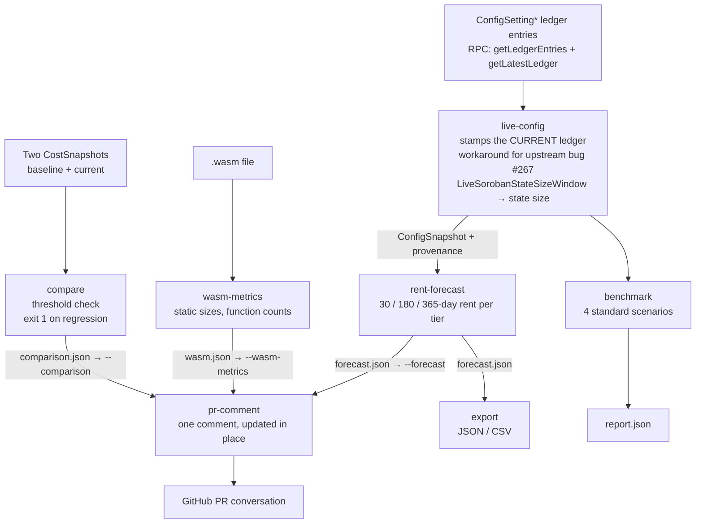

# Architecture

## Pipeline

Three structural facts worth naming:

1. **`live-config` is a first-class step**, not a hidden helper inside `rent-forecast`. It
   is where ledger provenance is produced, and it is the module slated for deletion once
   the upstream bug is fixed.
2. **`pr-comment` consumes files, never network state.** Everything that touches the
   network does so upstream of it. That is why the bot cannot fetch config on its own.
3. **`benchmark` is a leaf.** Its report is terminal output; nothing downstream consumes
   it. The `pr-comment` comparison section takes `compare` output, not a benchmark report.

## Modules

| Module | Responsibility |
|---|---|
| `src/main.rs` | CLI: argument parsing, config loading precedence, output formatting |
| `src/rent_forecast.rs` | Lead feature — the two-step protocol rent formula, per-tier horizons |
| `src/live_config.rs` | Live `ConfigSetting*` fetch; the upstream-bug workaround |
| `src/wasm_metrics.rs` | Static `.wasm` analysis via `wasmparser` |
| `src/benchmark.rs` | Four standard scenarios (empty/minimal/populated/heavy) + custom |
| `src/compare.rs` | Snapshot diff, threshold, CI exit code, Markdown rendering |
| `src/pr_comment.rs` | Comment rendering, marker-based update-in-place, octocrab client |
| `src/error.rs` | `BenchError` / `BenchResult` |

## Config loading precedence

Every network-touching command goes through one function in `main.rs`, which enforces a
strict order:

1. `--config-snapshot <path>` if given — parsed, never fetched.
2. **live fetch** — the default.
3. A **failed live fetch is a hard error**, naming the three options. It does not fall
   back.
4. `--allow-demo` — placeholder rates, banner-flagged, stamped
   `demo-config (NOT network data)` with `config_ledger: 0`.

The resulting `config_source` is carried through into every output format, so no artifact
can hide where its rates came from.

> Exception: `pr-comment` does not go through this function. It requires an explicit
> `--forecast <path>` — see [The PR comment bot](concepts/pr-comment-bot.md).

## Dependency on `soroban-cost-estimator`

Used as a **library** (crates.io v0.1.0, published 2026-08-03), never as a CLI wrapper.
Imported items:

- `config_snapshot::model::{ConfigSnapshot, StateArchivalV0, ContractLedgerCostV0}`
- `rpc::client::{RpcClient, resolve_endpoint}`
- `rpc::config::fetch_all_config_settings`
- `xdr_helper`

RPC simulation and WASM parsing are **not** re-implemented from the estimator.

### TLS provider pinning

`octocrab` is pinned to `rustls-aws-lc-rs` with `default-features = false` (other defaults
restated) so exactly one rustls provider is compiled in. The estimator's `reqwest` brings
`aws-lc-rs`; `octocrab`'s default brings `ring`. With both present, rustls 0.23 refuses to
select a process-level `CryptoProvider` and `octocrab` panics on its first HTTPS call.
This bug shipped because every test was a unit test that never opened a socket. See
[Verification](verification.md#the-rustls-defect).

## Data formats

Every command emits JSON on demand (`--json`), and the JSON is what the next stage
consumes. `pr-comment` is a pure function of the files you give it, which is why its
output is reproducible and reviewable with `--dry-run`.
